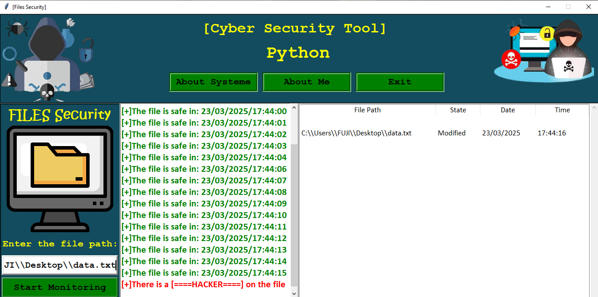

## Files Security Monitoring Tool

This program is a file protection and monitoring tool that monitors any changes to any selected file. 
If any changes are detected, the program triggers an audible alarm, takes a camera snapshot to record an image of the intruder, 
and logs all changes to the user interface.

## Output

## 🔍 How It Works

1. Run the Program: Run the main file using Python.

2. Enter the File Path: In the user interface, enter the full path to the file you want to monitor.

3. Start Monitoring: Click the "Start Monitoring" button to begin the monitoring process.

4. Notifications:

If the file has been modified, a notification will be displayed in the interface, and a warning sound will be played.

A photo will be taken using the device's camera and saved as hacker.png.

The event will be logged to the table.

## Features

Monitoring file size changes: The program constantly checks for changes in the target file size.

Instant notification        : If a change occurs, a visual notification appears and an audible alarm is triggered.

Event logging               : All operations are recorded in the user interface for easy tracking.

Camera usage                : An automatic photo is taken when any change is detected.

Simple graphical interface  : The interface is designed using Tkinter to make the program easy to use.