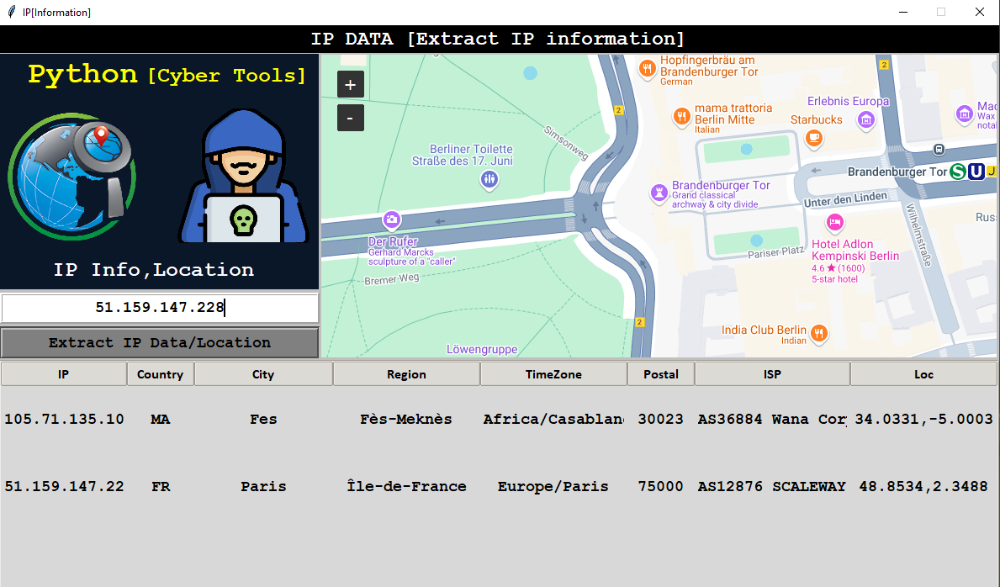

# IP Information Tool

This tool is a Python GUI application built on Tkinter and uses the requests library to send requests to https://ipinfo.io/ website to get ip information.
It displays information about IP in an easy-to-use interface.

## Output

