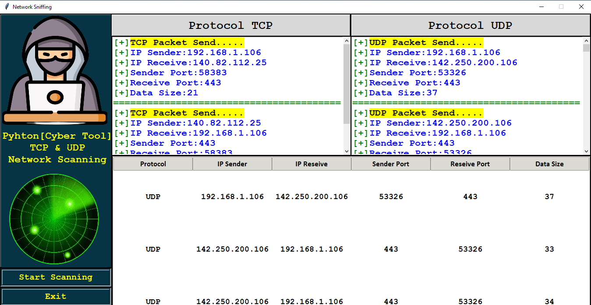

# Network Sniffing Tool

This tool is a Python GUI application built on Tkinter and uses the Scapy library to capture and analyze network packets.
It displays information about TCP and UDP packets in an easy-to-use interface.

## Output

## 🔍 How It Works

1. Clicking the Start Scanning button starts the sniff_data() function in a separate thread.

2. The sniff() function from Scapy listens on the WiFi interface and captures packets.

3. When a packet is received, it is passed to the data(packet) function, which:

Checks if the packet contains a TCP or UDP layer.

Extracts details such as IP addresses, ports, and data size.

Displays this information in the text fields and table in the GUI.

## 🖥️ How to Use

When the tool starts, the GUI will display:

A section for TCP packet details.

A section for UDP packet details.

A table displaying captured packet information.

Control buttons:

Start Scanning: Begins packet sniffing.

Exit: Closes the application

## 📝 Notes

Change the network interface name in sniff(iface='WiFi', prn=data) according to your system (eth0, wlan0, Ethernet, etc.).